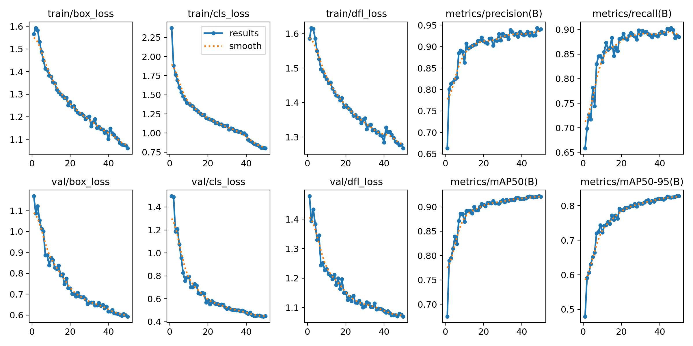
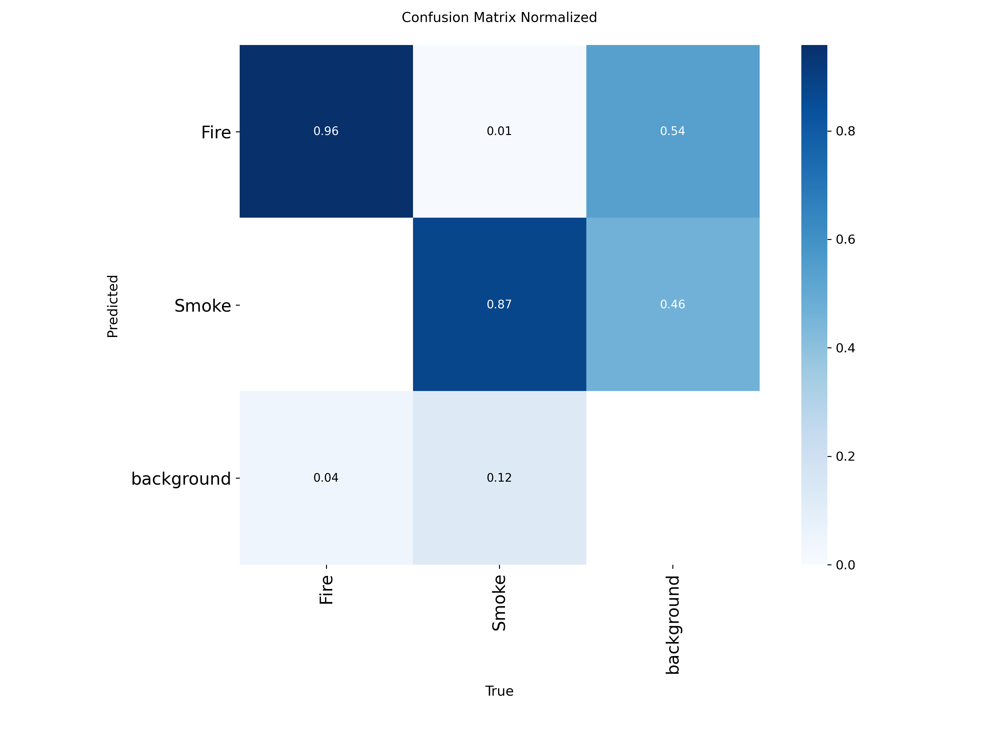
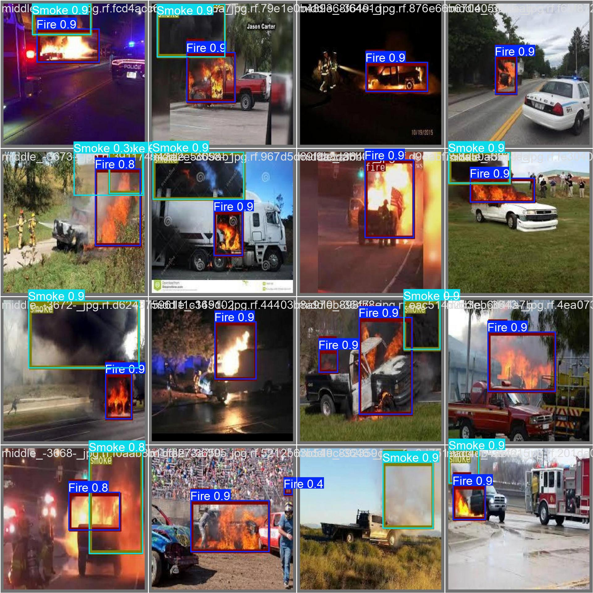
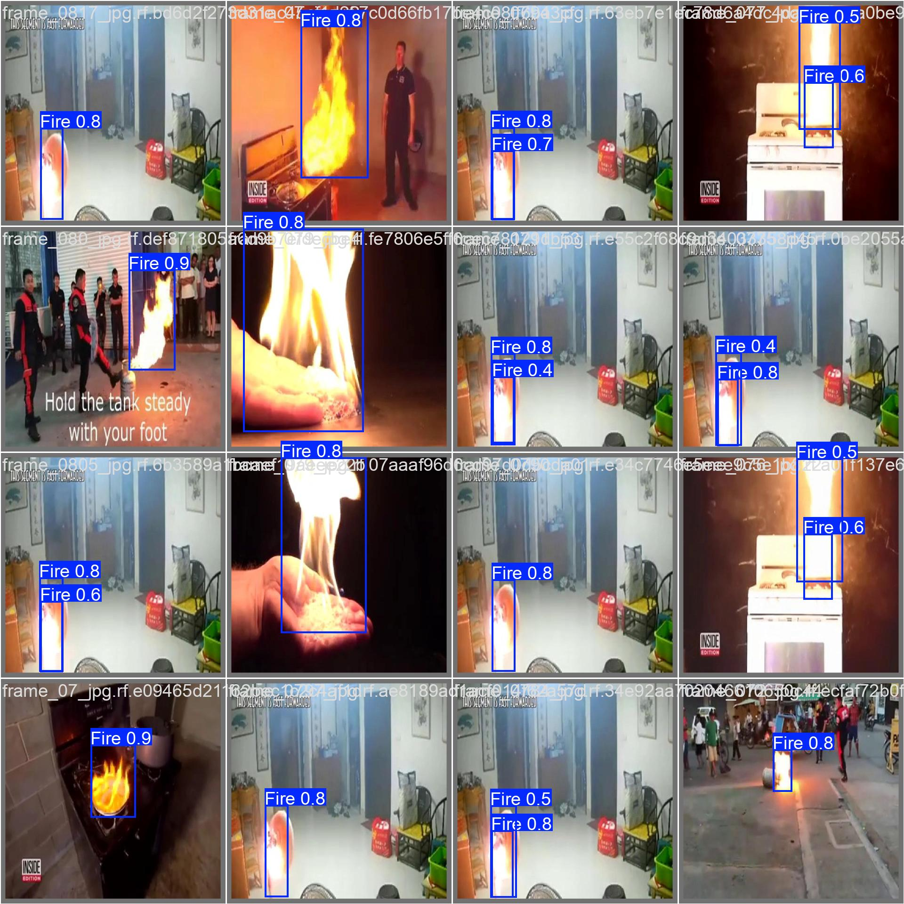

# 🔥 Fire and Smoke Detection using YOLOv11

> **Proje Türü:** Derin Öğrenme & Bilgisayarlı Görü  
> **Model:** YOLOv11n (Nano)  
> **Başarım (mAP50):** %92.1  
> **Platform:** Google Colab (Tesla T4 GPU)

## 📋 Proje Özeti (Abstract)
Bu proje, yangın ve dumanın erken aşamada tespit edilmesi amacıyla geliştirilmiş, **YOLOv11** mimarisini temel alan gerçek zamanlı bir nesne tespit sistemidir. Geleneksel duman dedektörlerinin yetersiz kaldığı açık alanlarda (orman, şantiye vb.) görsel veriyi işleyerek uyarı üretmeyi hedefler.

Eğitilen model, yangın (Fire) ve duman (Smoke) sınıflarını yüksek doğrulukla ayırt edebilmekte ve **~7.9ms** gibi çok düşük bir çıkarım (inference) süresiyle gerçek zamanlı uygulamalarda (Drone, Güvenlik Kamerası) kullanılabilmektedir.

---

## 📂 Veri Seti Analizi (Dataset)
Model eğitimi için Roboflow üzerinden temin edilen [Fire Detection Dataset](https://universe.roboflow.com/situational-awarnessinnovsense/fire-detection-ypseh) kullanılmıştır. Veri setinin yapısal analizi (`labels.jpg` verilerine göre) şu şekildedir:

* **Toplam Görsel:** 9.600+
* **Sınıf Dağılımı:** Veri setinde bir miktar sınıf dengesizliği (Class Imbalance) mevcuttur.
    * 🔥 **Fire:** ~10,215 etiket (Daha baskın sınıf)
    * 💨 **Smoke:** ~4,711 etiket
* **Preprocessing:** Tüm görseller 640x640 piksel boyutuna normalize edilmiştir.

---

## 📊 Performans ve Sonuçlar (Results)

Model 50 epoch boyunca eğitilmiş ve aşağıdaki kritik başarı metriklerine ulaşılmıştır:

### 1. Genel Başarı Tablosu
| Sınıf | Precision (Kesinlik) | Recall (Duyarlılık) | mAP50 | mAP50-95 |
| :--- | :---: | :---: | :---: | :---: |
| **Genel (All)** | **0.942** | **0.885** | **0.921** | **0.827** |
| Fire | 0.955 | 0.926 | 0.955 | 0.830 |
| Smoke | 0.930 | 0.844 | 0.887 | 0.825 |

### 2. Eğitim Grafikleri
Aşağıdaki grafiklerde görüldüğü üzere, "box_loss" ve "cls_loss" değerleri istikrarlı bir şekilde düşmüş, mAP değeri ise 50 epoch sonunda platoya ulaşmıştır. Overfitting (ezberleme) belirtisi gözlemlenmemiştir.



### 3. Karmaşıklık Matrisi (Confusion Matrix) Analizi
Modelin tahmin hatalarını incelediğimizde:
* **Doğruluk:** Ateş sınıfını %96, Duman sınıfını %87 oranında doğru bilmiştir.
* **Yanlış Alarmlar (False Positives):** Arka plan (background) olan bölgeleri yangın sanma oranı çok düşüktür.
* **Kaçırılanlar (Missed Detections):** Dumanın şeffaf yapısı nedeniyle, model %12 oranında dumanı arka plan zannetmiştir. Bu durum sınıf dengesizliğinden (duman verisinin azlığından) kaynaklanmaktadır.



### 4. F1 Skoru ve İdeal Eşik Değeri
F1 Eğrisine (`BoxF1_curve.png`) göre modelin en verimli çalıştığı güven eşiği (Confidence Threshold) **0.553**'tür. Bu değerde F1 skoru **0.91** seviyesindedir.


---

## 🖼️ Tahmin Örnekleri (Inference Examples)
Modelin test veri seti üzerindeki tahminleri aşağıda gösterilmiştir. Karmaşık sahnelerde bile yangın ve duman ayrımı başarıyla yapılmaktadır.

**Örnek 1 (Yangın ve Dumanın Bir Arada Olduğu Senaryo):**


**Örnek 2 (Farklı Açılar ve Işık Koşulları):**


---

## 📁 Proje Yapısı
* **`main.py`**: Webcam üzerinden gerçek zamanlı tespit yapan ana script.
* **`models/best.pt`**: Eğitilmiş en iyi model ağırlıkları.
* **`notebooks/Fire_Detection_Training.ipynb`**: Eğitim adımlarını içeren Jupyter Notebook dosyası.
* **`requirements.txt`**: Gerekli kütüphaneler.
* **`images/`**: Eğitim sonuç görselleri ve grafikler.

## 🚀 Kurulum ve Kullanım

Projeyi kendi bilgisayarınızda çalıştırmak için:

**1. Gereksinimleri Kurun:**
```bash
pip install -r requirements.txt
```

**2. Çalıştırma:**
Proje dizininde hazır bulunan `main.py` dosyasını çalıştırarak webcam üzerinden tespit yapmaya başlayabilirsiniz:

```bash
python main.py
```

`main.py` dosyasının içeriği şu şekildedir:

```python
from ultralytics import YOLO
import cv2

# Eğitilen ağırlıkları yükle
model = YOLO("models/best.pt")

# Webcam'den görüntü al ve tahmin yap
results = model.predict(source=0, show=True, conf=0.55) # 0.55 ideal eşik değerimiz
```

---

## 📝 Sonuç ve Gelecek Çalışmalar

Bu proje ile YOLOv11 kullanılarak yüksek doğruluklu bir yangın tespit sistemi geliştirilmiştir.

* **Güçlü Yönler:** Yüksek mAP (%92), hızlı tespit süresi.
* **Geliştirilebilir Yönler:** `images/labels.jpg` analizinde görülen duman veri azlığı giderilirse, duman tespiti (%88) ateş tespiti (%95) seviyesine çıkarılabilir.
